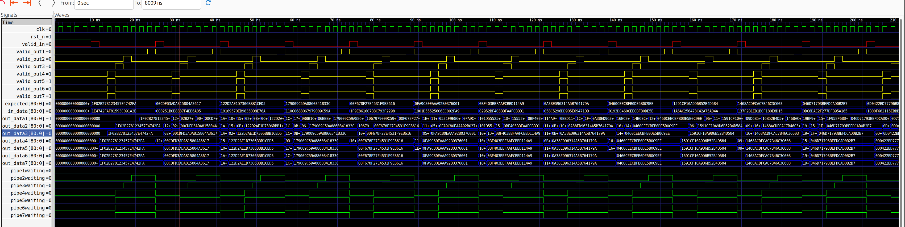

# QC_LDPC
RTL design for a "5G" multigigabit QC-LDPC pipelined encoder in System Verilog. Overall design was based on the following [research paper](#1) as well as other collected research documents 

The circuit has the ability to encode LDPC code blocks of all three of the standard lengths, _648, 1296,_ and _1944_ at a rate <ins>5/6</ins>, and uses the RU Algorithm in conjunction with extensive pipelining as well as various other discovered optimizations derived from research publications to create an high throughput QC-LDPC Encoder. 


# Included Resources
Inside ofthe source folder are included .mem files which define the base prototype matrix found in <ins>IEEE Std 802.11-2020</ins>, whose values define the shifts of the ZxZ identity matrix used to encode data found in . Each value is stored as in hexadecimal format, and the "-" values present in the prototype matrix found in the standard are replaced with the highest value of what would be the memory width required to store the matrix entires in memory as none of the Z values used for the given code block length reaches the maximum value of the data width which is used to store it inside of the defined code. _Note: These "-" values are used to define a zero matrix instead of a shift of the ZxZ identity matrix_  


## QC LDPC Parameters defined by the standard
| Coding Rate  | Information Block Bits | Total Codeword Bits
| :-----: | :-----: | :-----: |
| 1/2  | 972  | 1944  |
| 1/2  | 648  | 1296  |
| 1/2  | 324  | 648  |
| 2/3  | 1296  | 1944 |
| 2/3  | 864  | 1296  |
| 2/3  | 432  | 648  |
| 3/4  | 1458  | 1944  |
| 3/4  | 972  | 1296  |
| 3/4  | 486  | 648  |
| 5/6  | 1620  | 1944  |
| 5/6  | 1080  | 1296  |
| 5/6  | 540  | 648  |


---
---

## Pipelined Barrel Shifter

(pipedCircularShifter.sv) Included in the design is a a fully pipelined, generic right circular shifter implemented. The right rotator is paramerterizable to support a variety of pipeline depths to meet design needs. 

The shifter performs `MAX_Z`-bit wide input. As the over all LDPC design pads smaller width inputs to re-use the same barrel shifter pipelines to reduce area/LUT use. By default the Module decomposes the requested shift into `⌈log₂(MAXZ)⌉` binary-weighted rotation stages, rather than computing the full rotation in a single cycle or other predefined cycle count. This default was chosen to maximize potential FMAX, for designs intending to utilize LUT based memory. 

## Parameters
| Parameter | Default | Description |
|---|---|---|
| `MAXZ` | 81 | Bit-width of the data and maximum shift value. Input data should always be zero-padded to this width. |
| `ROTATES_PER_CYCLE` | 1 | Number of rotation stages collapsed into a single pipeline stage. Increase to reduce latency at the cost of FMax. |

---

## Ports

| Port | Direction | Description |
|---|---|---|
| `CLK` | Input | Clock |
| `rst_n` | Input | Active-low synchronous reset |
| `valid_in` | Input | Asserted when input data is valid |
| `in_data` | Input | Data word to be shifted (`MAXZ` bits wide) |
| `shift_val` | Input | Number of positions to rotate (`⌈log₂(MAXZ)⌉` bits) |
| `out_data` | Output | Rotated data word |
| `valid_out` | Output | Valid signal, delayed by pipeline latency to match `out_data` |

---

## Architecture
The shifter is broken into `NumStages = ⌈log₂(MAXZ) / ROTATES_PER_CYCLE⌉` pipeline stages. Each stage contains one or more `rotateStage` submodules, each of which conditionally applies a binary-weighted rotation (2⁰, 2¹, 2², ...) controlled by the corresponding bit of `shift_val`. A `valid` signal is propagated through a matching shift register so it arrives aligned with the rotated output data.

The `ROTATES_PER_CYCLE` parameter gives flexibility to trade pipeline depth against clock speed depending on the target platform and resource constraints — for example, on an FPGA with abundant routing resources you might collapse multiple stages to reduce latency, whereas the default of 1 targets maximum FMax.

A simpler fixed implementation (`pipelinedCircularShifterFMAX`) is also included, which hardcodes `ROTATES_PER_CYCLE = 1` and was the original baseline. The parameterized version above supersedes it but both are retained for reference. They are both also tested in the included testbench. 

---

## Pipeline Latency

Output data is valid `NumStages` clock cycles after the corresponding input, where:

```
NumStages = ⌈clog2(MAXZ) / ROTATES_PER_CYCLE⌉
```

With default settings (`ROTATES_PER_CYCLE = 1`, `MAXZ = 81`), this is **7 cycles**.

---

## Simulation

The waveform below shows the module operating correctly in simulation, verifying that `out_data` and `valid_out` appear aligned after the expected pipeline delay:



Further details of the specific test can be found in /tb/PipelinedShifterTB but for a quick summary, ROTATES_PER_CYCLE was set to values 1-7 and each instatiated DUT was tested utilizing the same 500 test vectors. 

## References
<a id="1">[1]</a> 
Y. Jung, C. Chung, J. Kim, and Y. Jung, “7.7Gbps encoder design for IEEE 802.11n/ac Qc-LDPC codes,” 2012 International SoC Design Conference (ISOCC), pp. 215–218, Nov. 2012. doi:10.1109/isocc.2012.6407078 

### TODO:
Using parallel accumulators and further pipelining in properly structured generate functions, further generalize design so that given a requested Through-put rate, the circuit will be generated such that it perform more calculations in a given cycle, sacrificing area and higher timing requirements for greater throughput (at some given clk frequency) 